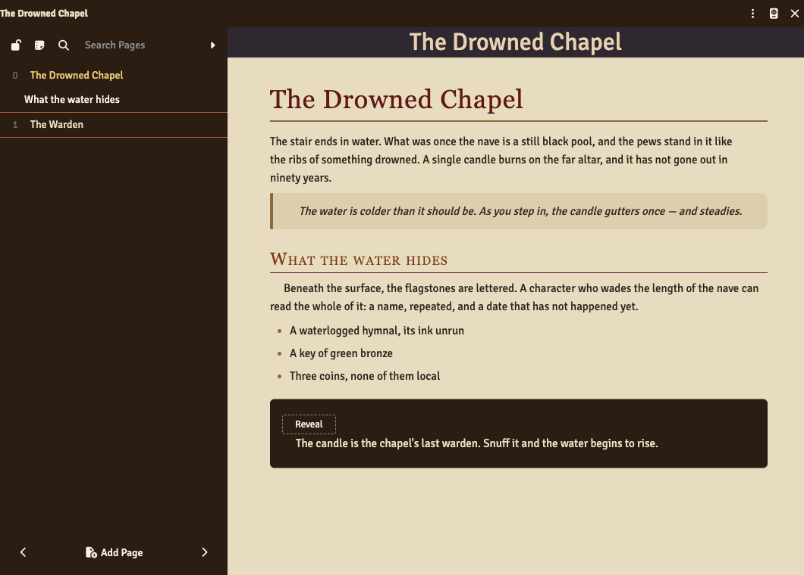
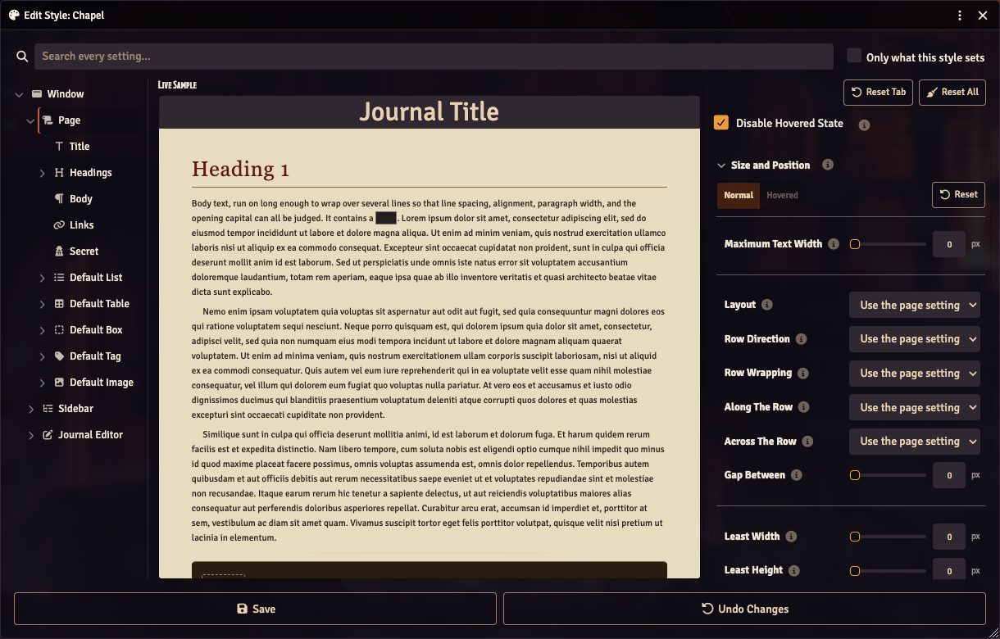
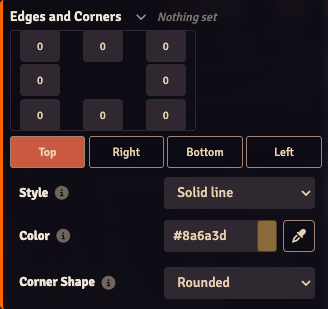
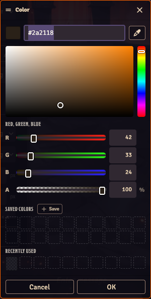

# Illuminus

Decorative styling for [Foundry Virtual Tabletop](https://foundryvtt.com/) journals,
applied **per journal** and configured entirely through a plain-language GUI. No CSS is
typed, and none is shown.

The name comes from the illuminated manuscripts of the medieval scriptorium — pages where
the decoration was not applied to the text but grew out of it: a capital swollen into a
picture, a margin filled with vines and grotesques, gold laid over gesso so the page
caught the light of whatever lamp you read it by. Those scribes had a working assumption
worth borrowing, which is that how a page looks is part of what it says. A journal in
Foundry is a page. This module is an attempt to let you treat it like one.

What you get is the look of a professionally produced adventure: parchment surfaces,
banner headings, boxed read-aloud text, ruled tables, drop caps, and secret passages your
players never see. Build a look once, apply it to whichever journals should wear it, and
carry it into another world — or out of Foundry entirely, as web pages, a single file, or
a PDF.

- **Foundry compatibility:** v14 (minimum `14`, verified `14.367`)
- **Game system:** system-agnostic — core Foundry APIs only
- **Build step:** none. Plain ES modules and CSS, loaded directly by Foundry.

## How this was made

Illuminus was built with the help of an AI assistant (Anthropic's Claude), working to my
direction. The idea, the design decisions, the priorities, and the artwork are mine; much
of the code, the tests, and this documentation were drafted by the assistant and shaped
over many rounds of use and correction.

I mention it because you deserve to know how the software you install was made, and
because the way it was made shows in the result. The module carries an automated suite
that drives a real Foundry instance and reads what the styling actually computes to —
over six hundred assertions, run before anything is committed. That is what I lean on
instead of trusting either of us.

No artwork ships with the module today. The images that will — artwork, photography, and
textures alike — are being made by hand with digital tools, without generative AI, and
this note will say so plainly once they are here.

Bugs, misjudgements, and anything that misbehaves in your world are mine to answer for.
Please do [report them](https://github.com/Aventhar/illuminus/issues).

## The editor

Three columns, and they answer three different questions.

**Down the left, what a journal is made of.** The parts nest the way they really do: the
window holds the page, the page holds its headings and its lists and its boxes, and each
family of treatments sits under the plain thing it varies. Every entry carries a count of
what this style has set inside it, so you can see at a glance where the work has gone.
Click a piece of the sample in the middle and the tree follows you to it.

**In the middle, what it looks like.** A miniature journal that repaints as you drag a
slider, and dims everything that is not the part you are working on — dimmed rather than
hidden, because a heading alone on a blank page tells you nothing about how it sits in
the text. Any real journal you have open repaints too.

**Down the right, what can be said about the part you picked.** Around 4,200 settings in
all, on 16 tabs — and close to 9,000 once every treatment is counted separately rather
than one at a time — each labelled in ordinary language with a line of explanation under
it. "Top Thickness", not `border-top-width`.

### What that looks like in practice

Nothing is collapsed into one control that ought to be four. Each of the four borders has
its own thickness, style and colour; each corner its own rounding *and shape*; each side
its own padding and margin. But four controls in a column is a poor way to describe a
box, so the ones that describe a shape are drawn as that shape:

A thickness at each corner, a side chosen underneath, and that side's style and colour
below it. Spacing works the same way — eight inputs around a dashed ring, the outer four
for the room around the box and the inner four for the room inside it. Each of these
folds to a single line saying what it is set to, built from the values themselves, and
one the style says nothing about reads "Nothing set" and starts closed. A tab therefore
opens showing what the style *does*.

- **Search every setting** from the box across the top. It narrows every part at once and
  dims the ones with nothing in them, so the tree itself answers "which part has the
  shadow settings?".
- **"Only what this style sets"** hides everything you have not touched.
- **Reset** works at three sizes — a control, a category, a whole part — and always
  returns to what you last *saved*, not to the factory settings.
- **Nothing is written to your world until you press Save**, and closing with unsaved
  changes asks first.

### Its own colour picker

Clicking a swatch opens Illuminus's picker rather than the operating system's — because
the native one cannot express alpha, and a transparent setting would show as solid black.
A shade square and hue strip to pick by eye, RGB sliders and numeric boxes to be exact,
opacity, and the hex including its alpha. Saved colours belong to the style and can be
named — "Parchment", "Rust heading" — and dragged into the order you want.

The eyedropper reads colours **out of the page** rather than off the screen. Point at
anything in the Foundry window — a fill, a border, lettering — and a readout follows the
cursor showing exactly what will be taken. Unlike the operating system's sampler it needs
no screen-capture permission, and it keeps transparency.

## What a style can say

- **Everything a page can hold.** Not just paragraphs and headings: definition lists,
  table captions, collapsible passages, code, embedded sound and video, and the marks the
  editor's own toolbar produces — highlighting, strike-through, underline, abbreviations,
  quotations. Two of those were not merely unstyled but unreadable before: a definition's
  text inherited Foundry's near-white, and highlighting arrived as yellow on black.
- **Secret passages.** Foundry's GM-only blocks arrive tinted purple with a Reveal button
  inside, which fights any page you build. They get their own part: a fill before
  revealing and a second one after, so you can see at a glance what the table has already
  been shown, plus the lettering, the edge, and the button itself.
- **The whole window, not just the page.** The contents panel — its entries, the page
  being read, sub-headings, category rows, page numbers, the search box, its buttons —
  and the window frame, its title bar, its icon buttons, and the Edit pencil. The page
  editor too: the toolbar, its icons, the drop-down menus, and the settings bar above
  them.
- **Treatments you apply by hand.** Five boxes, five inline tags, five picture treatments,
  five lists and five tables, each renameable per style, applied from an **Illuminus**
  menu in the page editor. A read-aloud box and an encounter box can look nothing alike;
  a stat block and a treasure table can disagree.
- **A hovered state on everything**, and a Selected state where it means something. Each
  starts empty, meaning "leave it alone", so nothing changes until you say so. Sizes and
  spacing are deliberately not shadowed on hover: changing those under the pointer makes
  the page slide out from under it.
- **Typography that behaves.** Line spacing, letter and word spacing, small caps,
  outlines and shadows on lettering, a drop cap that is a real element rather than
  `::first-letter` (so it can carry an outline), columns per heading level, and control
  over where lines may break and whether a long word may be hyphenated.
- **Surfaces with depth.** A fill can graduate from one colour to another, or frost what
  is behind it as frosted glass does. A background picture can sit behind any fill — with
  its own fit, position, blending and strength — and be softened, brightened, drained of
  colour or aged before it is laid down. Shadows sit inside and outside.
- **Shapes and placing.** A corner can be a bevel, a notch, a scoop or a squircle rather
  than a rounding. A picture can be cropped to a named shape — Square, Landscape,
  Widescreen, Panorama — saying which part to keep. A block can be turned a little, drawn
  larger than the room it takes, held in view while the page scrolls past it, or nudged
  aside.
- **Folding.** A heading can fold the run of text beneath it, and a contents entry can
  fold the entries under it. What is folded is remembered for the session but never
  stored, because a sheet re-renders on every edit.

**Background images come from anywhere in your Foundry data** — your own art, a system's,
another module's. A grayscale texture works best with a Fill Color under Multiply
blending, so the texture supplies the grain and the colour supplies the hue; a picture
carrying its own colour wants Fill Color set to white and Image Blending set to Normal.

**No artwork or styles are included — yet.** A world starts with no styles at all, and
the library is where you make your first one.

## Taking a journal out of Foundry

A styled journal can leave entirely, in four shapes:

| Format | What you get |
| --- | --- |
| **Web pages** | A folder: one HTML file per journal, an index, and the pictures beside them |
| **One file** | A single self-contained HTML file, pictures inlined — emailable |
| **Print / PDF** | Opens the browser's print dialogue, opening on a contents page whose entries are real PDF links |
| **Stylesheet** | The look without the words, renamed to a prefix of your choosing, for someone else's release |

The export mirrors Foundry's own markup, so every rule applies to it unchanged — and
without a style, it carries the CSS that is actually painting your pages, which is what
lets a game system's look travel with it.

Two honest notes. **Printing to PDF varies by browser**: Chromium writes its own PDF from
the print preview and keeps the document's internal links, while Safari and Foundry's
desktop app hand the job to the operating system's print panel, which flattens them. The
export says so unless it can see it is running in Chromium. And a **stylesheet export
carries no typefaces** — a font file is licensed to whoever installed it, so the file
names the faces and leaves finding them to whatever loads it.

## Using it

Three ways in, all GM-only:

| Where | What it does |
| --- | --- |
| Journals sidebar → **Journal Styles** button | Opens the style library |
| Right-click a journal in the sidebar → **Journal Style** | Assigns a style to that journal |
| A journal's window header → palette icon | Assigns a style to that journal |
| Configure Settings → Illuminus → **Open Style Library** | Opens the style library |
| Style library → **Export Journals…** | Saves journals as web pages |
| Right-click a journal in the sidebar → **Export as Web Pages…** | The same, for that journal |

**Adding fonts:** Illuminus offers whatever font families Foundry knows about, so install
custom fonts through Foundry's **Configure Font Families** menu and they appear in every
Typeface dropdown.

### Where things are

| I want to… | Go to |
| --- | --- |
| Build or edit a look | Journals sidebar → **Journal Styles** |
| Put a look on a journal | Right-click the journal → **Journal Style** |
| Wrap something in a box, tag or picture treatment | The page editor's **Illuminus** menu |
| Drop a ready-made page structure in | **Illuminus → Template** |
| Keep something you built for next time | Select it, then **Illuminus → Template → Save selection as template** |
| Tidy or share templates | Journals sidebar → **Templates** |
| See a style at full size, in a real journal | Style library → tick a style → **Sample Journal** |
| Set a passage in columns | The heading above it → **Columns**. Level 1 governs the text under the page's title |

## For developers

How a style becomes CSS, the file layout, the checks, and the public API are in
[ARCHITECTURE.md](ARCHITECTURE.md). What has changed and when is in
[CHANGELOG.md](CHANGELOG.md).

## License

[GNU General Public License v3.0 or later](LICENSE).

Copyright (C) 2026 Aventhar.

Illuminus is free software: you can redistribute it and/or modify it under the terms of
the GNU General Public License as published by the Free Software Foundation, either
version 3 of the License, or (at your option) any later version.

It is distributed in the hope that it will be useful, but WITHOUT ANY WARRANTY; without
even the implied warranty of MERCHANTABILITY or FITNESS FOR A PARTICULAR PURPOSE. See the
GNU General Public License for more details.

Anything bundled with the module — artwork, sample styles, templates — is redistributed
under the same terms, so only bundle what may be licensed that way.
